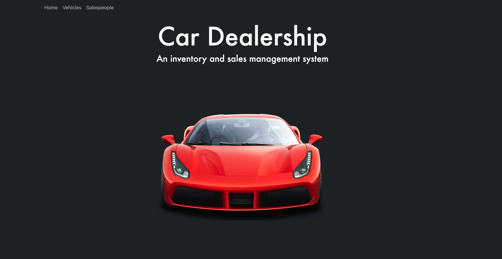

# Car Dealership Project


The Car Dealership project is designed to manage and showcase [car inventory](https://github.com/Pia007/car_app/assets/66088725/cf9e33b6-95df-4707-a257-e5e612825e30) and [salesperson data](https://github.com/Pia007/car_app/assets/66088725/904c49b8-7b32-4294-8748-444bd377fc6b) for a dealership. This README outlines the structure and components of the project, including design documents, database schema, API, and additional development features. The application is currently deployed via the Google Cloud Platform and can be viewed [here](https://car-app-wjuvn76ckq-uc.a.run.app).   

## Technologies Used

- **`Python`**: For building the backend logic and REST API.
- **`PostgreSQL`**: As the database management system to store and manage data.
- **`Django`**: As the web framework for the REST API, utilizing Django's generic views for efficient development.
- **`Docker`**: For containerization of the application.
- **`pgAdmin`**: For database management and querying.
- **`Google Cloud Platform`**: For deployment of the application.


## Project Structure

The project directory includes the following components:

### Initial Design


- **Postgres Database Schema(Models)**: Detailed schema of the `PostgreSQL database`.

  - **Table Designs**: Includes `column names`, `data types` ...etc.

  - **Foreign Key References**: Demonstrations of relationships: `1-to-Many`, `Many-to-1`

- **Generated ER Diagram using pgAdmin**

  - 


### API Endpoints

| Endpoint                              | Method    | Parameters | Description                               |
|---------------------------------------|-----------|------------|-------------------------------------------|
| `/cars/`                              | GET       |            | Retrieves a list of all cars              |
| `/cars/<int:pk>/`                     | GET       | `pk`       | Retrieves details of a specific car       |
| `/cars/new/`                          | POST      |            | Adds a new car                            |
| `/cars/<int:pk>/edit/`                | PUT, PATCH | `pk`       | Updates a specific car's details          |
| `/cars/<int:pk>/delete/`              | DELETE    | `pk`       | Deletes a specific car                    |
| `/cars/<int:car_id>/mark_not_sold/`   | POST      | `car_id`   | Marks a specific car as not sold          |
| `/salespeople/`                       | GET       |            | Retrieves a list of all salespeople       |
| `/salespeople/<int:pk>/`              | GET       | `pk`       | Retrieves details of a specific salesperson |
| `/salespeople/new/`                   | POST      |            | Adds a new salesperson                    |
| `/salespeople/<int:pk>/edit/`         | PUT, PATCH | `pk`       | Updates a salesperson's details           |
| `/salespeople/<int:pk>/delete/`       | DELETE    | `pk`       | Removes a specific salesperson            |


## Running the application locally
1. This project assumes that you have `Python` and `Docker` installed on your machine. If not, you can download them from the following links:
   - [Python](https://www.python.org/downloads/)
   - [Docker](https://www.docker.com/products/docker-desktop)
  
2. You will need to create a `.env` with the following environment variables:
   - `DB_NAME`=<your_db_name>
   - `DB_USER`=postgres
   - `DB_PASSWORD`=<your_password>
   - `DB_HOST`=127.0.0.1
   - `DB_PORT`=5432
  
3. Running the project locally:
```bash
# clone the repository:
git clone https://github.com/Pia007/car_app

# navigate to the project directory:
cd car_app

# create a virtual environment:
python -m venv venv 

# activate the virtual environment:
. venv/scripts/activate

# navigate to app directory:
cd car_app

# install the required packages:
pip install -r requirements.txt

# make migrations:
python manage.py makemigrations

# run database migrations:
python manage.py migrate

# start the Django development server http://127.0.0.1:8000/
python manage.py runserver 8000


# Optional - Running the project with Docker

# build the Docker image from the root directory:
docker build -t car_app_image .

# run the Docker container:
docker run -d --name car_app_container -p 8000:8000 car_app_image

# The application is now running on http://localhost:8000/
``` 

## Challenges

- **`Flask -> Django`**: This project was initially started and the decision was made to convert to Django. This required a complete re-write of the application, including the database schema, API, and frontend. The task was challenging but also provided an opportunity to learn more about Django and its capabilities. Consulting the [Django documentation](https://docs.djangoproject.com/en/3.2/) was extremely helpful in this process.

- **`Django Generic Views`**: Django's generic views were used to build the API. This required the use of classes to controll the logic of the views.  The generic views come with a lot of functionality and required some research and experimentation to understand how to implement them.

- **`Django Templates`**: Django templates were used to build the frontend. The concept template inheritancem, tags, and filters was much more complex than the Flask templating engine. In some cases, the templates were not rendering as expected and required some troubleshooting to resolve.

- **`Deployment`**: The application was deployed using the Google Cloud Platform. The course content and the GCP documentation were helpful in this process. The application is currently deployed via the Google Cloud Platform and can be viewed [here](https://car-app-wjuvn76ckq-uc.a.run.app).


## Further Development

- **`Salesperson Performance Tracking`** : Tools to monitor and analyze salesperson performance metrics, aiding in the evaluation of sales strategies and employee productivity.
- **`Customer Relationship Management (CRM)`**: Capabilities for managing customer data, enhancing customer engagement and sales opportunities.
- **`Real-Time Reporting and Analytics`**: Comprehensive reporting tools for real-time insights into inventory levels, sales trends, and market demands.
API Integration: A robust API for seamless integration with external systems and  


